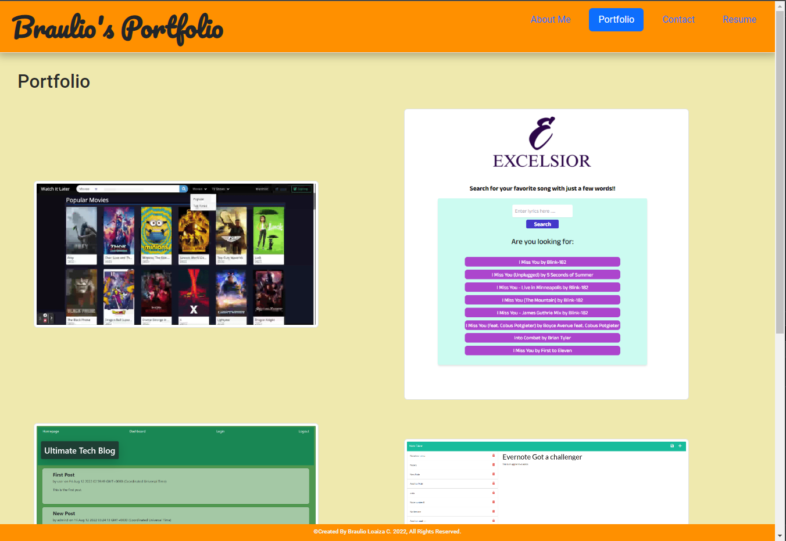

# Brand New Portfolio

## Description
This web page is my personal portfolio and has info about me and my projects, is made with React, CSS and Bootstrap.
You can download my resume and see each one of my previous project repositories.

## Table of Contents

- [Usage](#usage)
- [Licence](#licence)

## Usage
Install all the packages typing npm install and then you can run the server with npm start.

## Licence
The Unlicense

## Questions
[Github Profile](https://github.com/braulioloaizac)

Email : bloaizac@uqvirtual.edu.co

[Click here]() to get redirected to the webpage
